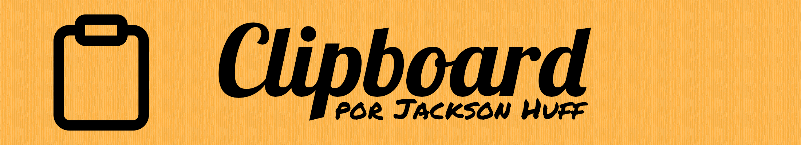
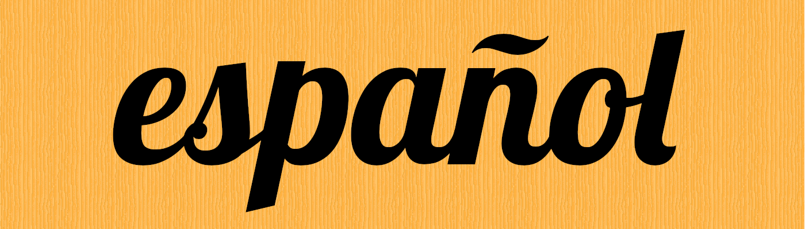
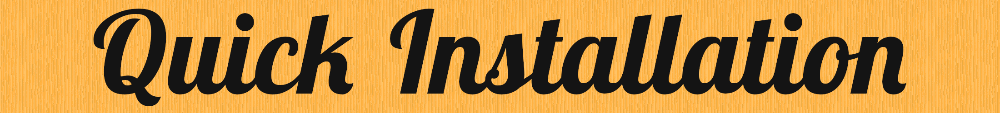
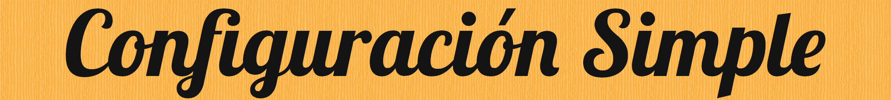

[](README.md)
[](README.es.md)

Corta, copia y pega absolutamente cualquier cosa en cualquier lugar que quisieras, mientras usas el terminal. Esta es la herramienta definitiva para el portapapeles.

- **Sin hinchazón.** Clipboard cuenta a los kilobytes con muchas plataformas.
- **Sin configuración.** Clipboard no necesita ninguna configuración para usarlo.
- **Sin esfuerzo.** Clipboard parece fácil a los novatos y a los profesionales por igual.
- **Sin dependencias.** Clipboard funciona con las plataformas Windows, Linux, Android, macOS, FreeBSD, OpenBSD, NetBSD, DragonFlyBSD o OpenIndiana, o cualquiera que funciona con C++20, sin dependencias. ¡De veras!
- **Universal.** Clipboard soporta el inglés, el español, el portugués y el turco.
- **Ahorrador de tiempo.** Clipboard te libera de las carpetas temporales feas y del memorizar de los archivos.


Puedes reemplazar `cb` por `clipboard` en todos los comandos.
Añade un número al final para escoger cualquier portapapeles que quisieras usar.

---

### Copiar
`clipboard ([--]copiar|[-]cp) (archivo) [archivos]`

---

### Cortar
`clipboard ([--]cortar|[-]ct) (archivo) [archivos]`

---

### Pegar
`clipboard ([--]pegar|[-]p)`

---

### Direccionar Por Adentro

`(algo) | clipboard [([-]dad)]`

---

### Direccionar Por Afuera

`clipboard [([--]pegar|[-]p] | (algo)`

o

`clipboard [([--]pegar|[-]p)] > (algún archivo)`

---

### Mostrar El Contenido
`clipboard ([--]mostrar|[-]ms)`

---

### Quitar
`clipboard ([--]quitar|[-]qt)`

---

### Ejemplos

```
cb copiar foo.txt bla.doc
clipboard cortar1 MiCarpeta
cb cp800 bar.conf OtraCarpeta baz.txt
```


### Linux, macOS, todos los BSDs y OI:
```bash
curl -sSL https://github.com/Slackadays/Clipboard/raw/main/install.sh > sh
```
### Windows:
```powershell
Invoke-WebRequest -UseBasicParsing https://github.com/Slackadays/Clipboard/raw/main/install.ps1 | powershell
```

---

### Clonar, Configurar, Compilar y Instalar A Mano
```bash
git clone https://github.com/slackadays/Clipboard
cd Clipboard
cmake .
cmake --build .
cmake --install .
```
Puedes escoger el prefijo de instalación con el indicador `-DCMAKE_INSTALL_PREFIX`.
```bash
cmake -DCMAKE_INSTALL_PREFIX=/PREFIJO .
```
---

### Desinstalar
Linux, macOS, todos los BSDs salvo OpenBSD y OpenIndiana:
```
sudo xargs rm < install_manifest.txt
```
OpenBSD:
```
doas xargs rm < install_manifest.txt
```
Windows:

Desinstala todos los archivos en install_manifest.txt.

---

### Actions

Graba las últimas versiones de Clipboard desde GitHub Actions.

---

### AUR

Los usuarios de Arch-Linux pueden instalar [clipboard](https://aur.archlinux.org/packages/clipboard), [clipboard-bin](https://aur.archlinux.org/packages/clipboard-bin) o [clipboard-git](https://aur.archlinux.org/packages/clipboard-git).

---



### `CI`

Pon esta variable ambiente para que Clipboard sobrescriba los archivos existentes sin preguntar al usuario cuando pegue. This variable is intended for Continuous Integration scripts where a live human is not present to make decisions.

---

### `FORCE_COLOR`

Pon esta variable ambiente para que Clipboard muestre los colores siempre independientemente del estado de `NO_COLOR`.

---

### `TMPDIR`

Pon esta variable ambiente a la carpeta que quisieras que Clipboard use para contener las cosas que copias o cortas.

---

### `NO_COLOR`

Pon esta variable ambiente to make Clipboard not show any colors.

---

### `--fast-copy`, `-fc`

Añade este indicador para usar los enlaces para copiar, cortar o pegar. Si cambies las cosas que usaste con este indiciador, las cosas que pegues tendrán los mismos cambios.

---


[Haz clic aquí](https://github.com/Slackadays/Clipboard/wiki) para acceder el Clipboard Wiki.


[Haz clic aquí](https://discord.gg/J6asnc3pEG) para unirte a nuestro grupo Discord.
