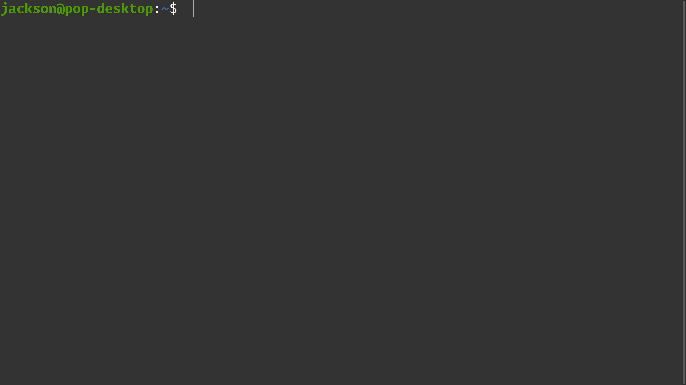
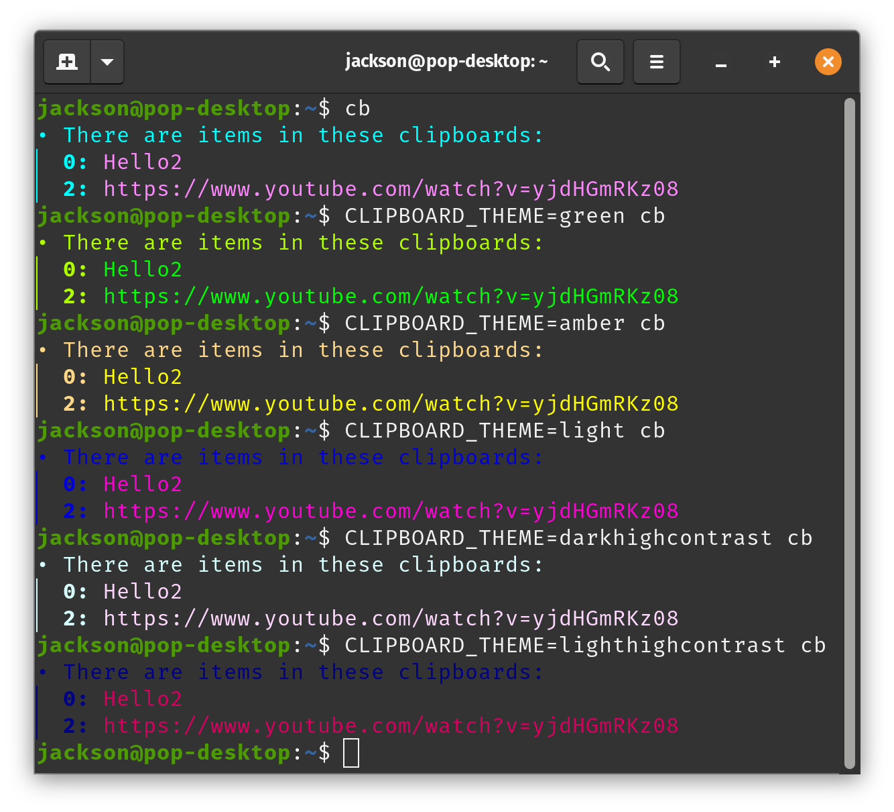

<br>

### 

<br>

<br>


The Clipboard Project is a fast and lightweight, feature packed, and user friendly tool that lets you do more on the computer in _style_. Seriously.

Say hello to one of the most advanced clipboard managers ever. Save time and effort easier than ever before.

Don't just take my word for it!


- Copy and paste text, files, directories, binary data, your goat, _anything_
- Infinite numbers of clipboards with unlimited capacity AND history each,
- Seamless integration with your [existing clipboard systems](https://github.com/Slackadays/Clipboard/wiki/GUI-Clipboard-Compat),
- Support for your favorite languages like español, português, and Türkçe,
- Superb scriptability to automate your workflows in a cinch, 
- Gorgeous  for your viewing pleasure,
- Documentation you'll actually want to read <sub>(all in this readme)</sub>
- And oodles more! <sub>(just <i>look</i> at that documentation!)</sub>

<br>

<i>I believe Clipboard is <b>the best tool for clipboard interaction</b>. As a matter of fact, as of today you have 2713 stars on github, kudos! Keep up the good work.</i>

\- pidario on GitHub.com

<br>

<i>Thanks for your work! This is by-far <b>one of my favourite projects</b> on GitHub!</i>

\- MiguelGuthridge on GitHub.com

<br>

<i>...I've just discovered CB & <b>it's suiting my needs very well!</b></i>

\- all64bits on Discord.com

<br>

<i>I started using this because <b>I just wanted an easy "cb copy && cb paste"</b> VS trying to remember the correct input AND output flags when Im using xclip with different file types. I write a lot of shell scripts that copy certain stuff like images and text and <b>this makes it a lot easier.</b></i>

\- SweetBabyAlaska on Reddit.com

<br>

<i>As a sysadmin and hourly terminal user, <b>I found it so useful.</b> Making stuffs some easier.</i>

\- Simpleboy_ir on Reddit.com

<br>

<i>Thank you for this app, <b>so simple yet effective!</b> Hats off 🎩 👌</i>

\- GlassGruber on GitHub.com

<br>



<p align="center" id="dummy">
    <a href="https://discord.gg/J6asnc3pEG">
        
    </a>
    <a href="https://github.com/Slackadays/Clipboard/actions">
        
        
        
    </a>
    <a href="https://app.codecov.io/gh/Slackadays/Clipboard">
        
    </a>
    <br>
    
    
    
    <br>
    <a href="https://github.com/Slackadays/Clipboard/releases">
        
    </a>
    <a href="https://twitter.com/GetClipboard">
        
    </a>
    
    
</p>

<br>

<br>

<p align="center">
    
</p>

<br>

<br>

### 

### <a href="https://github.com/Slackadays/Clipboard/blob/main/install.sh"></a>
```bash
curl -sSL https://github.com/Slackadays/Clipboard/raw/main/install.sh | sh
```
### <a href="https://github.com/Slackadays/Clipboard/blob/main/install.ps1"></a>
```powershell
(Invoke-WebRequest -UseBasicParsing https://github.com/Slackadays/Clipboard/raw/main/install.ps1).Content | powershell
```

<br>
<br>

### 

<a href="https://repology.org/project/clipboard/versions"></a>

**Alpine Linux** (you'll need to enable the Community packages first)
```sh
apk add clipboard
```

**AUR** (Use your favorite AUR helper such as `yay`. You can also get `clipboard-bin` and `clipboard-git`)
```sh
yay -S clipboard
```

**Flatpak Flathub** (You can also get our nightly Flatpak builds under **GitHub Downloads**)
```sh
flatpak install app.getclipboard.Clipboard
# After installing, do "alias cb='flatpak run app.getclipboard.Clipboard'" to use CB easily.
# Then, add that command to your terminal profile (like .bashrc) to make it work every time.
```


**Gentoo GURU and LiGurOS** (For Gentoo, enable the GURU repo first)
```sh
emerge -av app-misc/clipboard
```

**Homebrew**
```sh
brew install clipboard
```

**Nix**
```sh
nix-env -iA nixpkgs.clipboard-jh
```

**Pacstall**
```sh
pacstall -I clipboard-bin
```

**Scoop**
```powershell
scoop install clipboard
```

**Void Linux**
```sh
sudo xbps-install -S clipboard
```

**GitHub Downloads**

First, get the latest revision of the Clipboard Project [from GitHub Actions](https://nightly.link/Slackadays/Clipboard/workflows/build-clipboard/main) or the latest release [from GitHub Releases.](https://github.com/Slackadays/Clipboard/releases/latest)

Then, unpack what you just downloaded to a nice place anywhere on your system.

If you downloaded the Flatpak, then do `flatpak install what-you-downloaded.flatpak` and you're done. If not, then keep reading.

Finally, add CB to your PATH (so that you can run it anywhere) by doing one of the following:

```sh
# For all platforms except Windows
$ export PATH=$PATH:/where/you/unpacked/cb
# Add this to your terminal startup file like .bashrc or the equivalent so that it works every time.
# To get the current path (in case you don't know it), do the "pwd" command.

# For Windows PowerShell
> $Env:PATH += ";C:\where\you\unpacked\cb"
# Add this to your PowerShell profile (which is located in $profile) so that this works every time.
# To get the current path (in case you don't know it), do the "Get-Location" command.
```

<br>
<br>

### 
You'll need CMake and C++20 support, and if you want X11 and/or Wayland compatibility, you'll also need libx11 and/or libwayland plus Wayland Protocols.

Get the latest release instead of the latest commit by adding `--branch 0.8.0` right after `git clone...`.

Change the system installation prefix by adding `-DCMAKE_INSTALL_PREFIX=/custom/prefix` to `cmake ..`, or the library install location by adding `-DCMAKE_INSTALL_LIBDIR=/custom/dir`.
```bash
# First, let's download the code and go a nice place to build everything.
$ git clone https://github.com/Slackadays/Clipboard 
$ cd Clipboard/build

# Now let's set up CMake and build CB.
$ cmake -DCMAKE_BUILD_TYPE=MinSizeRel ..
$ cmake --build . -j 12

# Finally, let's install it onto our system.
$ cmake --install .
```

### 

Remove everything listed in `install_manifest.txt`. If you're not using Windows, you can also do `xargs rm < install_manifest.txt`.

<br>

<br>

<p align="center">
    
</p>

<br>

<br>

### 

### 

```sh
# Let's start by copying a file.
$ cb copy NuclearLaunchCodes.pdf

# Now, let's paste this file.
$ cb paste

# Not bad, right?

# Let's make a note for this clipboard.
$ cb note "Keep this a secret"

# What if you wanted to pipe the note in?
$ echo "Keep this a secret OR ELSE" | cb note

# Now let's cut a directory to a different clipboard.
$ cb cut69 MyDirectory

# We put the 69 right after "cut" to tell CB to put MyDirectory in clipboard 69.

# Let's add a file to this same clipboard.
$ cb add69 SomeFile

# To remove a file, enter its name to remove just that file.
$ cb remove69 SomeFile

# Alternatively, you can put in a regex pattern instead to generalize the removal.
$ cb remove69 "So.*le"

# Finally, let's paste what we have in clipboard 69.
$ cb paste69

# You can copy multiple files at the same time. 
# Let's try the "_420" persistent clipboard for this one.
$ cb copy_420 foo.bar NotAVirus.bar.mp3.exe

# Like before, we can remove anything with a regex patttern.
$ cb remove_420 "*.mp3\.exe"

# Notes work exactly the same way for every clipboard.
$ cb note_420 "Some kosher content here"

# Let's look at everything we've stored in clipboard _420.
$ cb show_420

# Now let's see our original note and then clear that clipboard. 
$ cb note
$ cb clear

# This is the same as "cb note" but for clipboard "_420" again.
$ cb note_420

# Let's shake things up. Say you have some kind of content you want to ignore.
# This content could be anything from a password to raw binary data.
# To ignore certain kinds of content, use a regex pattern of your choice.

# Let's try this with a classic example.
$ cb ignore "H.*2"

# This pattern will ignore anything starting with "H" and ending with "2."

# Now, this next command will fail because CB will ignore the content in it through the pattern.
$ cb copy "Hunter2"

# Let's get some more detailed information about our clipboards.
$ cb info
$ cb info69
$ cb info_420

# To wrap things up, let's get a bird's eye view of everything so far.
$ cb
# Doing "cb" is the exact same as "cb status."
$ cb status

# These are just a handful of examples. 
# Check the documentation below for tons more examples of all the commands!
```

<br>

### 

Add a number to the end of your action to choose which temporary clipboard you want to use (the default is 0). Or, add `_` to use a persistent clipboard instead.

<details><summary> &ensp; <b>Copy</b> &emsp; <code>cb [--](copy|cp)[(num)|_(id)] (file) [files]</code> or <code>(something) | cb [[--](copy|cp)][(num)|_(id)]</code></summary>

<br>

Copy a file.
```sh
$ cb copy FooFile
$ cb --copy FooFile
$ cb cp FooFile 
$ cb --cp FooFile
# These are the same!
```

Copy a file and a directory.
```sh
$ cb copy FooFile BarDir
# These are also the same!
```

Copy piped in data.
```sh
$ echo "Foobar" | cb
$ echo "Foobar" | cb copy 
# The "copy" action is optional here since the only possible action here in the first place is "copy"
```

Copy text directly.
```sh
$ cb copy "Aventura was the best bachata band"
```
Note: This happens instead of copying a file/directory if there is only one item present and that item doesn't exist as a file/directory.

Copy a file to the clipboard named "4"
```sh
$ cb copy4 FooFile
```

Copy piped in data to the persistent clipboard named "hello"
```sh
$ echo "Foobar" | cb copy_hello
```

Copy text to the clipboard named "hey"
```sh
$ cb --clipboard hey copy "Aventura was the best bachata band"
$ cb -c hey copy "Aventura was the best bachata band" 
# These are the same!
```

Copy a file with spaces and many directories to clipboard "50" using the abbreviated action name.
```sh
$ cb cp50 "Aventura/God's Project/04 Un Chi Chi.flac" BarDir BazDir
```

</details>

<br>

<details><summary> &ensp; <b>Cut</b> &emsp; <code>cb [--](cut|ct)[(num)|_(id)] (file) [files]</code> or <code>(something) | cb [[--](cut|ct)][(num)|_(id)]</code></summary>

<br>

Cut a file.
```sh
$ cb cut FooFile
$ cb --cut FooFile
$ cb ct FooFile 
$ cb --ct FooFile
# These are the same!
```

Cut a file and a directory.
```sh
$ cb cut FooFile BarDir
# These are also the same!
```

Cut piped in data.
```sh
$ echo "Foobar" | cb cut
```
Note: Cutting piped in data is the same as copying, except that CB will delete all content after you paste it somewhere.

Cut text directly.
```sh
$ cb cut "Hunter2"
```
Note: This happens instead of cutting a file/directory if there is only one item present and that item doesn't exist as a file/directory.

Cut a file to the clipboard named "4"
```sh
$ cb cut4 FooFile
```

Cut piped in data to the persistent clipboard named "hello"
```sh
$ echo "Foobar" | cb cut_hello
```

Cut text to the clipboard named "hey"
```sh
$ cb --clipboard hey cut "Aventura was the best bachata band"
$ cb -c hey cut "Aventura was the best bachata band"
# These are the same!
```

Cut a file with spaces and many directories to clipboard "50" using the abbreviated action name.
```sh
$ cb ct50 "Aventura/God's Project/04 Un Chi Chi.flac" BarDir BazDir
```

</details>

<br>

<details><summary> &ensp; <b>Paste</b> &emsp; <code>cb [--](paste|p)[(num)|_(id)] [regex] [regexes]</code> or <code>cb [[--](paste|p][(num)|_(id)] | (something)</code> or <code>cb [[--](paste|p)][(num)|_(id)] > (some file)</code></summary>

<br>

Start by copying or cutting something.
```sh
$ cb copy FooFile WhyAventuraIsTheBest.pdf
```

Paste in the current working directory.
```sh
$ cb paste
$ cb --paste
$ cb p
$ cb --p
# These are the same!
```
Note: If you paste after cutting, then CB will delete the original files that you cut.

Paste anything containing "Aventura."

```sh
$ cb p ".*Aventura.*"
```

Now, let's copy some raw data.
```sh
$ echo "Bananas!" | cb
```

Paste the raw data file in the current working directory.
```sh
$ cb paste
# Also the same
```

Pipe everything out to some file.
```sh
$ cb paste > SomeFile
```

Pipe everything from clipboard "42" out to some file.
```sh
$ cb paste42 > SomeFile
$ cb p42 > SomeFile
$ cb -c 42 > SomeFile 
# These three versions all work great!
```

Pipe everything out to some program.
```sh
$ cb | cat
# These three versions also all work great.
$ cb | Write-Output 
# The version for PowerShell
```

Pipe everything from persistent clipboard "2" out to some program.
```sh
$ cb paste_2 | cat
$ cb p_2 | cat
$ cb -c _2 | cat 
# These three versions also all work great.
$ cb -c _2 | Write-Output 
# The version for PowerShell
```

Note: If you paste after cutting, then CB will delete the raw data afterwards, effectively only letting you paste once.

</details>

<br>

<details><summary> &ensp; <b>Add Contents</b> &emsp; <code>cb [--](add|ad)[(num)|_(id)] (file|text) [files]</code> or <code>(something) | cb [[--](add|ad)][(num)|_(id)]</code></summary>

<br>

Start by copying something.
```sh
$ cb copy FooFile
```

Add a file.
```sh
$ cb add SomeOtherFile
$ cb --add SomeOtherFile
$ cb ad SomeOtherFile 
$ cb --ad SomeOtherFile
# CB now holds FooFile and SomeOtherFile
```

Add a directory.
```sh
$ cb add "We Broke The Rules"
```

Now let's copy some raw data.
```sh
$ cb copy "'Let me find that'"
```

Add raw data to the end of what's stored.
```sh
$ cb add " is one of Romeo Santos' catchphrases."
# The content is now: 'Let me find that' is one of Romeo Santos' catchphrases.
```

Add raw data by piping it in.
```sh
$ echo " What's yours?" | cb add 
# The content is now: 'Let me find that' is one of Romeo Santos' catchphrases. What's yours?
```

</details>

<br>

<details><summary> &ensp; <b>Remove Contents</b> &emsp; <code>cb [--](remove|rm)[(num)|_(id)] (regex) [regexes]</code> or <code>(some regex) | cb [[--](remove|rm)][(num)|_(id)]</code></summary>

<br>

Start by copying something.
```sh
$ cb copy FooFile BarDir BazDir
```

Remove everything starting with "B"
```sh
$ cb remove "B.*"
$ cb --remove "B.*"
$ cb rm "B.*"
$ cb --rm "B.*"
# CB will match this against "BarDir" and "BazDir" and remove them
```

Remove everything matching a specific name
```sh
$ cb remove "BarDir"
# CB will match this against "BarDir" only and remove it
```

Now let's copy some raw data.
```sh
$ cb copy "A bachatero is someone who makes bachata music."
```

Remove anything with a space beforehand and that ends with "-ero"
```sh
$ cb remove "(?<= ).*ero"
# The content is now: A  is someone who makes bachata music.
```

Remove anything matching "music" by piping the pattern in.
```sh
$ echo "music" | cb remove
# The content is now: A  is someone who makes bachata .
```

</details>

<br>

<details><summary> &ensp; <b>Show Contents</b> &emsp; <code>cb [--](show|sh)[(num)|_(id)] [regex] [regexes]</code> or <code>cb [--](show|sh)[(num)|_(id)] [regex] [regexes] | (something)</code></summary>

<br>

Start by copying something.
```sh
$ cb copy FooFile BarDir BazDir
```

List all the items in the clipboard.
```sh
$ cb show
$ cb --show
$ cb sh 
$ cb --sh
# These all work great!
```

Now let's copy some raw data.
```sh
$ cb copy "Those who are tired of bachata are tired of life"
```

Show the contents of the clipboard.
```sh
$ cb show
```

Show the raw filepaths of everything in the clipboard.
```sh
$ cb sh | cat
```

Show raw filepaths to a program.
```sh
$ cb copy "02 I Believe.flac"
$ eval vlc $(cb sh)
# Use the eval command here to process the raw filepath (which in this case looks like "/tmp/Clipboard/0/02 I Believe.flac") as if it were entered in a shell
# Otherwise, you'll likely get errors complaining about being unable to process quote characters.
```

</details>

<br>

<details><summary> &ensp; <b>Clear Clipboard</b> &emsp; <code>cb [--](clear|clr)[(num)|_(id)]</code></summary>

<br>

Start by copying something.
```sh
$ cb copy FooFile BarDir BazDir
```

Clear the clipboard of all data.
```sh
$ cb clear
$ cb --clear
$ cb clr 
$ cb --clr
# These all work great!
```

</details>

<br>

<details><summary> &ensp; <b>Edit Clipboard Content</b> &emsp; <code>cb [--](edit|ed)[(num)|_(id)] [editor]</code></summary>

<br>

Start by copying some text.
```sh
$ cb copy "Hello Clipboard! This is just some example content."
```

Edit the clipboard content.
```sh
$ cb edit
$ cb --edit
$ cb ed
$ cb --ed
# These all work great!
```

Use a custom editor to edit with.
```sh
cb edit nano
cb ed vim
cb ed code
```

</details>

<br>


### 

<details><summary> &ensp; <b>Load Contents</b> &emsp; <code>cb [--](load|ld)[(num)|_(id)] [clipboard] [clipboards]</code></summary>

<br>

Start by copying something.
```sh
$ cb copy "Yo dawg! I heard you liked bachata music."
```

Load the contents of the clipboard into other clipboards.

```sh
$ cb load 1 2 3 _foo
$ cb --load 1 2 3 _foo
$ cb ld 1 2 3 _foo
$ cb --ld 1 2 3 _foo
# All work great!
```

Note: If you don't provide a destination clipboard, then the Load action will load the contents into the default clipboard.

Load the contents of some clipboard into the default.

```sh
$ cb load_foo
```

Note: This is useful if you want to load content into GUI clipboard systems, as they only connect to the default clipboard.

</details>

<br>

<details><summary> &ensp; <b>Swap Contents</b> &emsp; <code>cb [--](swap|sw)[(num)|_(id)] [clipboard]</code></summary>

<br>

Start by copying something to two clipboards.
```sh
$ cb copy "After breaking up from Aventura, Romeo Santos' music just wasn't up to snuff."
$ cb copy2 "I'd just like to interject for a moment. What you're referring to as Linux, is in fact, GNU/Linux, or as I've recently taken to calling it, GNU plus Linux."
```

Swap the contents of two clipboards.

```sh
$ cb swap 2
$ cb --swap 2
$ cb sw 2
$ cb --sw 2
# All work great!

$ cb swap2
$ cb --swap2
$ cb sw2
$ cb --sw2
# Since swapping is commutative, the target can be freely swapped with the destination.
```

Note: If you don't provide a destination clipboard, then the Swap action will swap the contents into the default clipboard.

</details>

<br>

<details><summary> &ensp; <b>Import Clipboards</b> &emsp; <code>cb [--](import|imp) [source folder]</code></summary>

<br>

Start by exporting a clipboard.
```sh
$ cb copy "The reason Aventura was so popular was because the music was so well-written as well as the luscious guitar chorus effect."
$ cb export
```

Import all clipboards from a folder.
```sh
$ cb import
$ cb --import
$ cb imp
$ cb --imp
# These all work great!
```

Note: Currently, CB imports from a folder called `Exported_Clipboards`.

Choose what folder to import from.
```sh
$ cb import MySavedClipboards
```

</details>

<br>

<details><summary> &ensp; <b>Export Clipboards</b> &emsp; <code>cb [--](export|ex) [clipboard] [clipboards]</code></summary>

<br>

Start by copying something.
```sh
$ cb copy "Aventura's music is some of the most erotic you'll find anywhere."
```

Export all clipboards to a folder.
```sh
$ cb export
$ cb --export
$ cb ex
$ cb --ex
# These all work great!
```

Note: Currently, CB exports to a folder called `Exported_Clipboards`.

Choose what clipboards to export.
```sh
$ cb export 1 2 3
```

</details>

<br>

<details><summary> &ensp; <b>Queue Clipboard History</b> &emsp; <code>cb [--](history|hs)[(num)|_(id)]</code></summary>

<br>

Start by copying several things.
```sh
$ cb copy "There are at least two \"Anthony Santos\" who are known for bachata music: the \"regular\" Anthony Santos and Anthony \"Romeo\" Santos."
$ cb copy "blah blah blah"
$ cb copy "Clipboard Project is the best clipboard manager around"
```

Show the history.
```sh
$ cb history
$ cb --history
$ cb hs
$ cb --hs
# These all work great!
```

</details>

<br>

<details><summary> &ensp; <b>Get Older Clipboard Entries</b> &emsp; <code>cb [--](history|hs)[(num)|_(id)] (clipboard) [clipboards]</code></summary>

<br>

Start by copying several things.
```sh
$ cb copy "There are at least two \"Anthony Santos\" who are known for bachata music: the \"regular\" Anthony Santos and Anthony \"Romeo\" Santos."
$ cb copy "blah blah blah"
$ cb copy "Clipboard Project is the best clipboard manager around"
```

Bring an older entry (or entries) to the front.
```sh
$ cb history 1
$ cb --history 2
$ cb hs 1
$ cb --hs 1 2
# These all work great!
```

</details>

<br>

### 

<details><summary> &ensp; <b>Set Note</b> &emsp; <code>cb [--](note|nt)[(num)|_(id)] (text)</code> or <code>(something) | cb [[--](note|nt)][(num)|_(id)]</code></summary>

<br>

Add a personal note to a clipboard.
```sh
$ cb note "For my Aventura music collection"
$ cb --note "For my Aventura music collection"
$ cb nt "For my Aventura music collection"
$ cb --nt "For my Aventura music collection"
# All work great!
```

Add a personal note to a clipboard by piping it in.
```sh
$ echo "For my Aventura music collection" | cb note
```

Remove a note from a clipboard.
```sh
$ cb note ""
```

</details>

<br>

<details><summary> &ensp; <b>Show Note</b> &emsp; <code>cb [--](note|nt)[(num)|_(id)]</code></summary>

<br>

Start by adding a note to a clipboard.
```sh
$ cb note "For my Aventura music collection"
```

Show the note you added.
```sh
$ cb note
$ cb --note
$ cb nt
$ cb --nt
```

</details>

<br>

<details><summary> &ensp; <b>Set Ignore Rules</b> &emsp; <code>cb [--](ignore|ig)[(num)|_(id)] (regex) [regexes]</code> or <code>(regex) | cb [[--](ignore|ig)][(num)|_(id)]</code></summary>

<br>

Set some kinds of content to always ignore.
```sh
$ cb ignore "(?<![A-Za-z0-9/+=])[A-Za-z0-9/+=]{40}(?![A-Za-z0-9/+=])"
$ cb --ignore "(?<![A-Za-z0-9/+=])[A-Za-z0-9/+=]{40}(?![A-Za-z0-9/+=])"
$ cb ig "(?<![A-Za-z0-9/+=])[A-Za-z0-9/+=]{40}(?![A-Za-z0-9/+=])"
$ cb --ig "(?<![A-Za-z0-9/+=])[A-Za-z0-9/+=]{40}(?![A-Za-z0-9/+=])"
# All work great!
# "(?<![A-Za-z0-9/+=])[A-Za-z0-9/+=]{40}(?![A-Za-z0-9/+=])" is the regex for an AWS SK secret.
```

Set an ignore regex rule by piping it in.
```sh
$ echo "[abc]{10}" | cb ignore
```

Remove all ignore regex rules from a clipboard.
```sh
$ cb ignore ""
```

</details>

<br>

<details><summary> &ensp; <b>Show Ignore Rules</b> &emsp; <code>cb [--](ignore|ig)[(num)|_(id)]</code></summary>

<br>

Start by adding some ignore regex rules to a clipboard.
```sh
$ cb ignore "Foo" "Bar" "Baz"
```

Show the rules you just added.
```sh
$ cb ignore
$ cb --ignore
$ cb ig
$ cb --ig
```

</details>

<br>

<details><summary> &ensp; <b>Show Detailed Info</b> &emsp; <code>cb [--](info|in)[(num)|_(id)]</code> or <code>cb [--](info|in)[(num)|_(id)] | (something)</code></summary>

<br>

Show helpful details for a clipboard.
```sh
$ cb info
$ cb --info
$ cb in
$ cb --in
# All are the same!
```

Output these helpful details in JSON format.
```sh
$ cb info | cat
$ cb info | jq
```

</details>

<br>

<details><summary> &ensp; <b>Search Clipboard Contents</b> &emsp; <code>cb [--](search|sr)[(num)|_(id)] (query) [queries]</code></summary>

<br>

Start by copying several things.
```sh
$ cb copy Foo Bar Baz
$ cb copy "Some example content"
$ cb copy2 "Blah bleh bluh bloh"
```

Search a clipboard's contents.
```sh
$ cb search Foo
$ cb --search Blah
$ cb sr Bar
$ cb --sr Baz
# All are the same!
```

</details>

<br>

<details><summary> &ensp; <b>Show Help Message</b> &emsp; <code>cb (-h|[--]help)</code></summary>

<br>

Show the help message.
```sh
$ cb help
$ cb --help
$ cb -h 
# These three versions all work great!
```

</details>

<br>

<details><summary> &ensp; <b>Check All Clipboards' Status</b> &emsp; <code>cb [[--]status|st]</code> or <code>cb [--](status|st) | (something)</code></summary>

<br>

Check the status of all clipboards that have content.
```sh
$ cb status
$ cb --status
$ cb st
$ cb --st
$ cb 
# These all work great!
```

Get the status of all clipboards in JSON format.
```sh
$ cb status | cat
```

</details>

<br>

### 

Need to paste a funky symbol somewhere a lot? Copy it to a persistent clipboard.
```sh
$ cb cp_theta θ
$ cb -c amog cp ඞ
```

Paste whatever's in the clipboard straight into your favorite text editor.
```sh
# Vim
:r !cb
# Nano
[Ctrl-T] cb
# VSCode
cb | code -
```

Copy a password securely by deleting it once you've pasted it.
```sh
$ cb cut "AVeryStrongPassword!"
$ cb | some-program
# Now gone
```

On a slow system? Cache certain things so you don't have to do them again.
```sh
$ neofetch | cb cp_neo
$ cb | cat
```
    
Yank anything sitting in your terminal without ever touching the mouse.
```sh
$ env | yank -d = -- cb
```
    
Choose a text clipboard entry to instantly copy to the main clipboard using dmenu.
```sh
cb st | jq -r '.[]' | dmenu | cb
```

Need to share or pore over log files? Copy them in one step!
```sh
$ journalctl | cb
# For systemd
$ sudo dmesg | cb
# For Linux; note that you're not running "sudo cb" here
$ cb copy logs/latest.log
# For Minecraft servers
```

Want CB to look different? Change up the color scheme.
```sh
# This one looks like The Matrix
$ export CLIPBOARD_THEME=green
$ cb
# This one is for light backgrounds
$ export CLIPBOARD_THEME=light
$ cb
# Check out the other themes too!
```

Here's what some of these themes might look like.



Make your own scripts that can fully automate your workflows.
```sh
#!/bin/sh
# This script does nothing except serve as an example of automating CB.
link="https://SomeWebsiteWithLotsOfContent"
wget link
cb copy *.jpg *.png
cb remove "AZ.*\.png"
cb | tar -cf foobar.tar
cb -c footar < foobar.tar
cb note "Latest files from website ABCXYZ"
```

<br>
    
<br>

<p align="center">
    
</p>

<br>
    
<br>

### 

### 

<details><summary> &ensp; <b><code>--all</code>, <code>-a</code></b> &emsp; Add this when clearing to clear all clipboards at once, or when searching to search all clipboards.</summary>

<br>

Start from a blank slate.
```sh
$ cb --all clear
```
WARNING! This will get rid of everything you've stored with CB, so be very careful when clearing with this option.

</details>

<br>

<details><summary> &ensp; <b><code>--clipboard (clipboard)</code>, <code>-c (clipboard)</code></b> &emsp; Add this to choose which clipboard you want to use. </summary>

<br>

Choose a non-default clipboard.
```sh
$ cb -c 5 copy Foobar
$ cb --clipboard 10 copy BarBaz
```

Copy to a temporary clipboard that doesn't start with a number.
```sh
$ cb -c SomeCB copy "A really really long sentence, and I mean really realy super DUPER long!"
```

Note: Although copying to a temporary clipboard that doesn't start with a number is impossible using the conventional method of adding it to the end of the action, this alternative method is completely supported and works great.

Choose a persistent clipboard.
```sh
$ cb -c _ copy "Generation Next"/*
```

</details>

<br>

<details><summary> &ensp; <b><code>--entry (entry)</code>, <code>-e (entry)</code></b> &emsp; Add this to choose which history entry you want to use. </summary>

<br>

Choose a non-default history entry.
```sh
$ cb -e 5 copy Foobar
$ cb --entry 10 copy BarBaz
```

Note: To copy to a non-default entry, that entry must exist already.

</details>

<br>

<details><summary> &ensp; <b><code>--fast-copy</code>, <code>-fc</code></b> &emsp; Add this to use links when copying, cutting, pasting, or loading. If you modify the items that you used with this flag, then the items you paste will have the same changes.</summary>

<br>

Copy a lot of files in much less time than before.
```sh
$ cb --fast-copy copy /usr/bin/*
```

</details>

<br>

<details><summary> &ensp; <b><code>--mime</code>, <code>-m</code></b> &emsp; Add this to request a specific content MIME type from GUI clipboard systems.</summary>

<br>

Save GUI clipboard content of a specific MIME type to the main clipboard.
```sh
$ cb --mime text/html | cb
```

</details>

<br>

<details><summary> &ensp; <b><code>--no-confirmation</code>, <code>-nc</code></b> &emsp; Add this to disable confirmation messages from CB. </summary>

<br>

Reduce distractions after showing some text content.
```sh
$ cb -nc sh | cat
```

</details>

<br>

<details><summary> &ensp; <b><code>--no-progress</code>, <code>-np</code></b> &emsp; Add this to disable progress messages from CB. </summary>

<br>

Reduce distractions while doing a search that takes a while.
```sh
$ fzf | cb -np
```

</details>

<br>

<details><summary> &ensp; <b><code>--bachata</code></b> &emsp; Add this for something special! </summary>

<br>

Make your life less boring.
```sh
$ cb --bachata
```

</details>
    
<br>
<br>

### 

<details><summary> &ensp; <b><code>CI</code></b> &emsp; Set this to anything to make CB overwrite existing items without a user prompt when pasting. This variable is intended for Continuous Integration scripts where a live human is not present to make decisions.</summary>

<br>

Use CB in a CI script.
```sh
...
cb cp Temp/*
...
cb p
...
```

</details>

<br>

<details><summary> &ensp; <b><code>CLIPBOARD_EDITOR</code></b> &emsp; Set this to the editor you want to use for the Edit action. </summary>

<br>

Set a custom editor to use.
```sh
$ export CLIPBOARD_EDITOR=nano
```

Note: The environment variables `EDITOR` and `VISUAL` by default take precedence if `CLIPBOARD_EDITOR` isn't set.

</details>

<br>

<details><summary> &ensp; <b><code>CLIPBOARD_HISTORY</code></b> &emsp; Set this to the maximum history size you want to keep, like <code>10000</code> or <code>50gb</code>. </summary>

<br>

`CLIPBOARD_HISTORY` supports up to 2^32 - 1 as a value. So, go ahead. Crank that b*tch up to a billion.
```sh
$ export CLIPBOARD_HISTORY=1000000000
$ cb copy "Oh yeah!"
```

Only keep a certain amount of data.
```sh
$ export CLIPBOARD_HISTORY=100tb
$ cb copy Yo_Mama.tar.gz
```

Note: You can choose between `tb`, `gb`, `mb`, `kb`, and `b` to specify amounts for terabytes, gigabytes, megabytes, kilobytes, and bytes respectively.

Only keep a certain time length.
```sh
$ export CLIPBOARD_HISTORY=52w
```

Note: You can choose between `y`, `m`, `w`, `d`, and `h` to specify amounts for years, months, weeks, days, and hours respectively.

</details>

<br>

<details><summary> &ensp; <b><code>CLIPBOARD_LOCALE</code></b> &emsp; Set this to the locale that only CB will use for its commands and output, like <code>en_US.UTF-8</code> or <code>es_DO.UTF-8</code>. </summary>

<br>

Change the locale to match what you're more comfortable with.
```sh
$ export CLIPBOARD_LOCALE=es_DO.UTF-8
$ cb cp "Amo a Aventura"

> $Env:CLIPBOARD_LOCALE=es_DO.UTF-8
# Powershell version
```

Override the locale case-by-case.
```sh
$ export CLIPBOARD_LOCALE=fr_CA.UTF-8
...
$ CLIPBOARD_LOCALE="" cb cp Foobar
```

</details>

<br>

<details><summary> &ensp; <b><code>CLIPBOARD_TMPDIR</code></b> &emsp; Set this to the directory that only CB will use to hold the items you cut or copy into a temporary directory.</summary>

<br>

Choose a special place to put your temporary clipboards this one time.
```sh
$ CLIPBOARD_TMPDIR=/home/jackson/SomeDirectory cb copy *
```

Choose a special place to put your temporary clipboards every time.

```sh
$ export CLIPBOARD_TMPDIR=/home/jackson/SomeDirectory
$ cb copy *
> $Env:CLIPBOARD_TMPDIR = /home/jackson/SomeDirectory
# Powershell
```

Note: By default, CB uses the C++ filesystem library function `fs::temp_directory_path()` to generate the temporary directory, prioritizing `CLIPBOARD_TMPDIR` and then `XDG_RUNTIME_DIR` respectively first if CB can get a value from them.

</details>

<br>

<details><summary> &ensp; <b><code>CLIPBOARD_PERSISTDIR</code></b> &emsp; Set this to the directory that only CB will use to hold the items you cut or copy into a persistent directory.</summary>

<br>

Choose a special place to put your persistent clipboards this one time.
```sh
$ CLIPBOARD_PERSISTDIR=/home/jackson/SomeDirectory cb copy *
```

Choose a special place to put your persistent clipboards every time.

```sh
$ export CLIPBOARD_PERSISTDIR=/home/jackson/SomeDirectory
$ cb copy *
> $Env:CLIPBOARD_PERSISTDIR = /home/jackson/SomeDirectory
# Powershell
```

Note: By default, CB uses the user's home directory to generate the persistent directory, prioritizing `CLIPBOARD_PERSISTDIR` and then `XDG_STATE_HOME` first respectively if CB can get a value from them.

</details>

<br>

<details><summary> &ensp; <b><code>CLIPBOARD_ALWAYS_PERSIST</code></b> &emsp; Set this to anything to make CB always use persistent clipboards.</summary>

<br>

Make everything you copy persistent.

```sh
$ export CLIPBOARD_ALWAYS_PERSIST=1
$ cb copy Foo Bar Baz
# This puts everything in the persistent directory but still with the clipboard name "0"
```

</details>

<br>

<details><summary> &ensp; <b><code>CLIPBOARD_NOEMOJI</code></b> &emsp; Set this to anything to strip emojis from CB's messages.</summary>

<br>

Get rid of those ugly emojis.
```sh
$ export CLIPBOARD_NOEMOJI=1
$ cb cp "You won't be annoyed 😒 by these things ever again! 😏😋🥵"
```

Note: This option only strips emojis from CB's own messages. So, if you copied some text that happens to contain emojis, then those will still remain.

</details>

<br>

<details><summary> &ensp; <b><code>CLIPBOARD_NOGUI</code></b> &emsp; Set this to anything to disable integration with GUI clipboards.</summary>

<br>

Debug a flaky GUI system by disabling its integration with CB.

```sh
$ CLIPBOARD_NOGUI=1 cb show
$ export CLIPBOARD_NOGUI=1
$ cb show
```

</details>

<br>

<details><summary> &ensp; <b><code>CLIPBOARD_NOPROGRESS</code></b> &emsp; Set this to anything to disable only progress messages from CB.</summary>

<br>

Reduce distractions while doing a search that takes a while.
```sh
$ fzf | CLIPBOARD_NOPROGRESS=1 cb
```

Disable progress messages from CB entirely.
```sh
$ export CLIPBOARD_NOPROGRESS=1
$ fzf | cb
```

</details>

<br>

<details><summary> &ensp; <b><code>CLIPBOARD_NOREMOTE</code></b> &emsp; Set this to anything to disable remote clipboard sharing.</summary>

<br>

Disable all clipboard content transfers through the terminal.
```sh
$ export CLIPBOARD_NOREMOTE=1
```

</details>

<br>

<details><summary> &ensp; <b><code>CLIPBOARD_SILENT</code></b> &emsp; Set this to anything to disable progress and confirmation messages from CB.</summary>

<br>

Rest in peace by seeing nothing that isn't an error.
```sh
$ export CLIPBOARD_SILENT=1
$ cb cp "I'm running out of Aventura references"
```

</details>

<br>

<details><summary> &ensp; <b><code>CLIPBOARD_THEME</code></b> &emsp; Set this to the color theme that CB will use. Choose between <code>light</code>, <code>darkhighcontrast</code>, <code>lighthighcontrast</code>, <code>amber</code>, and <code>green</code> (the default is <code>dark</code>).</summary>

<br>

Remind yourself of the terminals of the past.
```sh
$ export CLIPBOARD_THEME=green
$ cb cp "I'm in the Matrix now"
$ export CLIPBOARD_THEME=amber
$ cb cp "Yellow terminals feel just like sitting in front of a nice campfire"
```

Make CB more accessible.
```sh
$ export CLIPBOARD_THEME=darkhighcontrast
$ cb show
```

</details>

<br>

<details><summary> &ensp; <b><code>FORCE_COLOR</code></b> &emsp; Set this to anything to make CB always show color regardless of what you set <code>NO_COLOR</code> to.</summary>

<br>

Override somebody else's choice to disable colors.
```sh
$ export NO_COLOR=1
...
$ FORCE_COLOR=1 cb copy "There are almost no bachateros where I live right now"
```

Note: CB also supports `CLICOLOR_FORCE`.

Override somebody else's choice to disable colors, but in a different way.
```sh
$ export CLICOLOR=0
...
$ CLICOLOR_FORCE=1 cb copy "There are almost no bachateros where I live right now"
```

</details>

<br>

<details><summary> &ensp; <b><code>NO_COLOR</code></b> &emsp; Set this to anything to make CB not show any colors.</summary>

<br>

Make CB look boring.
```sh
$ export NO_COLOR=1
$ cb cp "From the 1960s until the 1990s, bachata was perceived as boring music for poor Dominicans."
```

Note: CB also supports `CLICOLOR`.

Make CB look boring, but in a different way.
```sh
$ export CLICOLOR=0
$ cb cp "In the 1990s, though, several innovative musicians reinvigorated bachata by using electric guitars with fancy effects."
```

</details>
 
<br>
<br>
<br>

### 

We're here for you! Check out [the Clipboard Project Wiki](https://github.com/Slackadays/Clipboard/wiki) for even more information, ask all your burning questions in [GitHub Discussions](https://github.com/Slackadays/Clipboard/discussions), or join [the awesome Discord group](https://discord.gg/J6asnc3pEG)!

<p align="center">
    <a href="https://github.com/Slackadays/Clipboard/wiki">
    <a href="https://github.com/Slackadays/Clipboard/discussions"></a>
    <a href="https://discord.gg/J6asnc3pEG"></a>
    <a href="https://twitter.com/GetClipboard"></a>
</p>

<br>
<br>

### 

Say thank you to all our beautiful contributors who have helped make the Clipboard Project incredible[.](https://www.youtube.com/watch?v=yjdHGmRKz08)
 Want to join the club? We're always accepting [new contributions](https://github.com/Slackadays/Clipboard/blob/main/.github/CONTRIBUTING.md) too.

And if you're feeling generous, feel free to give us a :star:! We appreciate every single one - including yours.
    
<br>

<p align="center"> 
    
</p>

<br>

<p align="right"><sub><code>cb copy haters && cb > /dev/null</code></sub></p>
