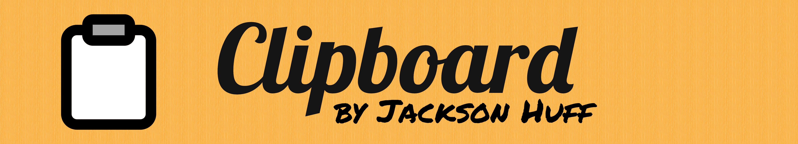

Cut, copy, and paste absolutely anything anywhere you want, all from the comfort of your terminal! The clipboard powertool for the command line.

- **Zero-bloat.** Clipboard rings in at mere kilobytes on most platforms.
- **Zero-config.** Clipboard doesn't require any configuration to use.
- **Zero-effort.** Clipboard is friendly to newbies and power users alike.
- **Zero-dependency.** Clipboard works on any up-to-date Windows, Linux, Android, macOS, FreeBSD, OpenBSD, NetBSD, DragonFlyBSD, or OpenIndiana system, or anything that supports C++20, all with ZERO dependencies. Yes, really!
- **Universal.** Clipboard supports English, Spanish, Portuguese, and Turkish locales.
- **A time-saver.** Clipboard frees you from ugly, temporary directories and memorizing file locations!


In all commands, you can substitute `cb` for `clipboard`. 
Add a number to the end of the action to choose which clipboard you want to use (the default is 0). 

---

### Copy
`clipboard [--](copy|cp) (file) [files]`

---

### Cut
`clipboard [--](cut|ct) (file) [files]`

---

### Paste
`clipboard [--](paste|p)`

---

### Pipe In

`(something) | clipboard [[--](copy|cp)]`

---

### Pipe Out

`clipboard [[--](paste|p] | (something)`

or

`clipboard [[--](paste|p)] > (some file)`

---

### Show Contents
`clipboard [--](show|sh)`

---

### Clear
`clipboard [--](clear|clr)`

---

### Examples

```
cb copy foo.txt launchcodes.doc
clipboard cut1 MyDirectory
cb cp800 bar.conf AnotherDirectory baz.txt
```


### Clone, Configure, & Compile 
```
git clone https://github.com/slackadays/Clipboard
cd Clipboard
cmake .
cmake --build .
```

---

### Install
Linux, macOS, all BSD except OpenBSD, OpenIndiana:
```bash
sudo cmake --install .
```
OpenBSD:
```bash
doas cmake --install .
```

Windows:
```bash
cmake --install .
```

Change the installation prefix with the `-DCMAKE_INSTALL_PREFIX` flag.
```bash
cmake -DCMAKE_INSTALL_PREFIX=/CUSTOM/PREFIX .
sudo cmake --install .
```
---

### Uninstall
Linux, macOS, all BSD except OpenBSD, OpenIndiana:
```
sudo xargs rm < install_manifest.txt
```
OpenBSD:
```
doas xargs rm < install_manifest.txt
```
Windows:

You may need to individually remove all the files in install_manifest.txt.

---

### Actions

You can also download Clipboard builds from GitHub Actions.

---

### AUR

Arch-Linux users can install the [clipboard](https://aur.archlinux.org/packages/clipboard), [clipboard-bin](https://aur.archlinux.org/packages/clipboard-bin), or [clipboard-git](https://aur.archlinux.org/packages/clipboard-git) AUR package.

---


### `CI`

Set this environment variable to make Clipboard overwrite existing items without a user prompt when pasting. This variable is intended for Continuous Integration scripts where a live human is not present to make decisions.

---

### `FORCE_COLOR`

Set this environment variable to make Clipboard always show color regardless of what you set `NO_COLOR` to.

---

### `TMPDIR`

Set this environment variable to the directory that Clipboard will use to hold the items you cut or copy.

---

### `NO_COLOR`

Set this environment variable to make Clipboard not show any colors.

---

### `--fast-copy`, `-fc`

Add this flag to use links when copying, cutting, or pasting. If you modify the items that you used with this flag, then the items you paste will have the same changes.

---


[Click here](https://github.com/Slackadays/Clipboard/wiki) to go the Clipboard Wiki.


[Click here](https://discord.gg/J6asnc3pEG) to go to our Discord group.
